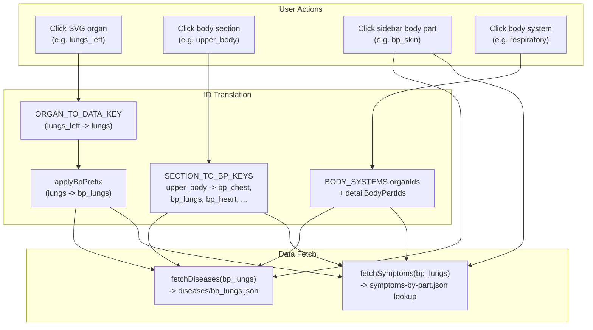

# Disease and Symptom Data Mapping Audit

## How Data Is Stored

There are **three layers** of data that connect the interactive body model to diseases and symptoms:

### Layer 1: SVG Organs (19 clickable organ regions)

Defined in `[src/data/organs.ts](src/data/organs.ts)`. Each organ has an `id` used as the `data-part` attribute in the SVG:

`brain`, `larynx_trachea`, `thyroid`, `liver`, `lungs_right`, `heart`, `lungs_left`, `knee_joint`, `gallbladder`, `spleen`, `pancreas`, `kidneys`, `stomach`, `intestines`, `muscle`, `thymus`, `bladder`, `male_reproductive`, `female_reproductive`

### Layer 2: Body Part Keys (86 `bp_` identifiers)

Defined in `[src/data/body-parts.ts](src/data/body-parts.ts)`. These are the canonical lookup keys used to fetch disease and symptom data. Examples: `bp_brain`, `bp_lungs`, `bp_skin`, `bp_blood`, `bp_joints`.

### Layer 3: Data Files

- **Master disease index**: `[public/data/diseases.json](public/data/diseases.json)` -- `Record<bp_key, Array<{code, name}>>` (83 keys)
- **Per-part disease shards**: `[public/data/diseases/bp_*.json](public/data/diseases/)` -- 83 files, each `Array<{name}>` (code stripped by `[scripts/split-diseases.js](scripts/split-diseases.js)`)
- **Symptoms by part**: `[public/data/symptoms-by-part.json](public/data/symptoms-by-part.json)` -- `Record<bp_key, string[]>` (84 keys)
- **Flat symptom list**: `[public/data/symptoms.json](public/data/symptoms.json)` -- `string[]` (for autocomplete)

### Data Generation Pipeline

`[generate-data-files.py](generate-data-files.py)` contains a `BODY_PART_MAP` that translates raw anatomical terms from ICD-10 batch data (`docs/body_parts_batches/`) and LLM-extracted results (`docs/body_parts_results/`) into `bp_` keys. It writes legacy JS globals (`diseases-data.js`, `symptoms-by-bodypart-data.js`), which were later converted to the JSON files above.

---

## How Body Parts Connect to Data

Key translation logic in `[src/data/data-service.ts](src/data/data-service.ts)`:

- `ORGAN_TO_DATA_KEY`: maps SVG organ IDs that differ from their data key (e.g. `lungs_left` -> `lungs`, `muscle` -> `muscles`, `knee_joint` -> `knee`, `female_reproductive` -> `uterus`, `male_reproductive` -> `penis`)
- `applyBpPrefix()`: prepends `bp_` to the translated key
- Section clicks expand via `SECTION_TO_BP_KEYS` in `[src/data/section-mapping.ts](src/data/section-mapping.ts)`

---

## Gap Analysis: What Is NOT Correctly Mapped

### Gap 1: Body parts in code with NO disease data file (2 missing files)

These `bp_*` IDs are referenced in `body-parts.ts` or `section-mapping.ts` but have **no corresponding disease JSON file**:

| Body Part ID         | Referenced From           | Impact                                   |
| -------------------- | ------------------------- | ---------------------------------------- |
| `bp_digestive_tract` | `body-parts.ts` (sidebar) | Clicking in sidebar triggers fetch error |
| `bp_mammary`         | `body-parts.ts` (sidebar) | Clicking in sidebar triggers fetch error |

### Gap 2: Body parts in code with NO symptom data (2 missing keys)

These `bp_*` IDs exist in `body-parts.ts` but are **not in `symptoms-by-part.json`**:

| Body Part ID | Impact            |
| ------------ | ----------------- |
| `bp_mammary` | No symptoms shown |
| `bp_thymus`  | No symptoms shown |

### Gap 3: Section mapping references non-existent data

`SECTION_TO_BP_KEYS` in `[section-mapping.ts](src/data/section-mapping.ts)` includes:

- `bp_urinary_tract` -- has symptom data (84 keys) but **no disease file** (only 83 disease files)
- `bp_pelvis` -- present in symptoms but has **no disease file**
- `bp_fallopian_tubes` -- present in symptoms but has **no disease file**
- `bp_lips` -- present in body-parts.ts but has **no disease or symptom file**
- `bp_teeth` -- referenced in section mapping, has **no disease file**

(Note: the fetch uses `.catch(() => [])` so these fail silently and return empty arrays)

### Gap 4: Disease/symptom count mismatch

- **diseases.json**: 83 `bp_` keys
- **symptoms-by-part.json**: 84 `bp_` keys
- **body-parts.ts**: 86 entries

The symptom data has 1 more key than disease data. Body parts code has 2-3 more entries than either data file.

### Gap 5: TypeScript type vs actual file schema mismatch

`data-service.ts` types the fetched disease response as `Array<{code: string; name: string}>` but the split shard files only contain `{name}` (no `code`). This works at runtime because only `name` is used, but it's technically a type lie.

### Gap 6: No disease-to-symptom cross-referencing

Diseases and symptoms are **parallel, independent datasets** keyed by body part. There is no mapping from a specific disease to its specific symptoms. They are only related by sharing the same `bp_` key.

### Gap 7: Data quality issues in symptoms

Typos exist in symptom strings (e.g. `"Abdomenal pain"` alongside `"Abdominal pain"` in `bp_abdomen`).

---

## Remediation Strategy

### Task 1: Create missing disease data files

Generate or create empty-array JSON files for body parts that exist in code but have no disease shard: `bp_digestive_tract`, `bp_mammary`, `bp_urinary_tract`, `bp_pelvis`, `bp_fallopian_tubes`, `bp_lips`, `bp_teeth`.

### Task 2: Add missing symptom keys

Add `bp_mammary` and `bp_thymus` entries to `symptoms-by-part.json`.

### Task 3: Build a validation script

Create a script (Node.js or Python) that:

- Reads all `bp_` IDs from `body-parts.ts`, `section-mapping.ts`, and `systems.ts`
- Reads all keys from `diseases.json` and `symptoms-by-part.json`
- Lists all disease shard files
- Reports any ID that exists in code but not in data (or vice versa)
- Can be run as a CI check or pre-commit hook

### Task 4: Fix type definition

Update the `fetchDiseases` return type to `Array<{name: string}>` to match the actual shard file schema (or add `code` back to the shards).

### Task 5: Clean symptom typos

Deduplicate and fix typos in symptom strings (automated pass with manual review).

### Task 6: Populate missing disease/symptom content

For the newly created placeholder files, populate with real medical data using the same ICD-10 pipeline or LLM-assisted generation that created the original data.
