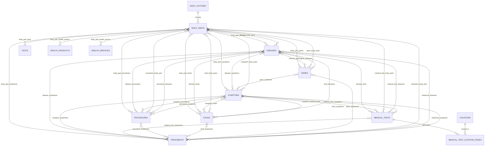

# Master Plan: Building a Large-Scale Medical Content Directory

## A Comprehensive Guide to Building, Deploying, and Managing 600K+ Landing Pages

---

## Part 1: Understanding the Architecture of Large Content Directory Sites

### How Sites Like This Actually Work

Large content directory sites (think WebMD, Healthline, Zocdoc, Yelp, or even niche directories like Healthgrades) share a common architectural DNA. They don't create each page by hand — they use **templatized, data-driven page generation** backed by a well-structured database. Here's the core mental model:

```
Structured Database (entities + relationships)
        ↓
Template Engine (reusable page layouts)
        ↓
Rendering Layer (static generation or server-side rendering)
        ↓
CDN (global caching + fast delivery)
        ↓
User's Browser
```

Every page on your site is the result of **a template + a data record**. A "Chest X-Ray in Roswell, GA" page is the same template as "MRI in Atlanta, GA" — just populated with different data. This is the fundamental insight that makes 600K pages manageable.

### The Key Pieces That Must Come Together

1. **Data Layer** — Your structured database of body systems, body parts, diseases, symptoms, medical tests, locations, medical procedures, treatments, foods and vitamins, DNA genes, health products and services, and all their relationships
2. **Content Layer** — The actual text, descriptions, FAQs, and media that populate each page
3. **Template Layer** — Reusable page layouts for each entity type (body part page, disease page, test+location page, etc.)
4. **Rendering/Build Layer** — The system that combines data + content + templates into actual HTML pages
5. **Infrastructure Layer** — Hosting, CDN, caching, and deployment pipeline
6. **SEO Layer** — Sitemaps, internal linking, structured data, canonical URLs, meta tags
7. **CMS/Admin Layer** — How you and your team manage content at scale
8. **Monitoring Layer** — Analytics, indexing status, performance tracking, error detection

---

## Part 2: Technology Stack Recommendation

### The Modern Stack for a 600K-Page Directory

For a site of this scale, the recommended stack is:

#### Framework: Next.js (App Router)

**Why Next.js specifically:**

- **Hybrid rendering** — You can mix static generation (SSG), incremental static regeneration (ISR), and server-side rendering (SSR) on a per-route basis. This is critical for your use case.
- **File-system routing with dynamic segments** — Routes like `/diseases/[slug]` and `/imaging/[medical-test]-[city]-[state]` are native.
- **Built-in image optimization, metadata API, and sitemap generation.**
- **Massive ecosystem and community** — When you hit edge cases at 600K pages, someone has solved it before.
- **Vercel deployment** is purpose-built for this, but you can also self-host.

#### Database: PostgreSQL

**Why PostgreSQL:**

- Handles complex relational data beautifully (body parts → diseases → symptoms → medical tests → procedures → treatments → food, all many-to-many).
- Full-text search built in (saves you from needing Elasticsearch early on).
- JSON columns for flexible/semi-structured data (like varying metadata per entity type).
- Battle-tested at massive scale.
- Extensions like PostGIS for geographic queries (useful for your location pages).

#### ORM/Query Layer: Prisma or Drizzle ORM

- Type-safe database queries in TypeScript.
- Schema migrations built in.
- Drizzle is lighter and faster; Prisma has better DX for complex relations. Either works.

#### CMS for Content Management: Headless CMS

Options ranked for your use case:

1. **Sanity.io** (best for structured content with complex relationships) — GROQ query language is powerful, real-time collaboration, customizable studio.
2. **Strapi** (self-hosted, open source) — Full control, REST + GraphQL APIs, good for teams that want to own everything.
3. **Custom Admin Panel** (built with Next.js + your DB) — Most flexible, no vendor lock-in, but more upfront work.

For 600K pages with complex entity relationships, a **custom admin panel + PostgreSQL** is often the best long-term choice. Headless CMSes can struggle with this volume of interconnected records.

#### Hosting & CDN

- **Vercel** — Purpose-built for Next.js, handles ISR natively, global edge network. Best DX, but can get expensive at scale.
- **Cloudflare Pages + Workers** — Cheaper at scale, incredible performance, but more manual setup.
- **AWS (CloudFront + Lambda@Edge + S3)** — Most control, best for very large scale, steepest learning curve.

**Recommendation:** Start with Vercel, plan migration path to Cloudflare or AWS when costs exceed ~$500/month.

#### Search

- Start with PostgreSQL full-text search.
- Graduate to **Typesense** or **Meilisearch** (both open source, fast) when you need faceted search, typo tolerance, and instant results.

---

## Part 3: Data Architecture — The Foundation of Everything

### Entity-Relationship Model

This is the single most important design decision. Get this wrong and everything downstream suffers.

The updated model is no longer just a simple body-part → disease → symptom structure. It is now a **medical knowledge graph** with body systems, body parts, diseases, symptoms, medical tests, procedures, treatments, foods, genes, health products, health services, locations, and generated landing pages all connected through explicit junction tables.



### Core Database Tables

```sql
-- Body Systems (11 records)
body_systems: id, name, slug, description, meta_title, meta_description, content_html, image_url, sort_order

-- Body Parts (80+ records)
body_parts: id, name, slug, description, meta_title, meta_description, content_html, image_url, body_system_id (FK)

-- Diseases (70,000+ records)
diseases: id, name, slug, icd10_code, description, meta_title, meta_description, content_html, image_url, severity, prevalence

-- Symptoms (20,000 records)
symptoms: id, name, slug, description, meta_title, meta_description, content_html, image_url

-- Medical Tests (4,000 records)
tests: id, name, slug, type (blood/imaging/etc), description, meta_title, meta_description, content_html, image_url, cpt_code, preparation_info

-- Locations (600 records)
locations: id, city, state, state_abbr, slug, population, lat, lng, metro_area, description

-- Procedures (1000s records)
procedures:  id, name, slug, type(surgery, non-invasive/etc), description, meta_title, meta_description, content_html, img_url

-- Medical Treatments (100K+ records)
treatments:  id, name, slug, type (medicine, therapy, alternative/etc), description, meta_title, meta_description, content_html, img_url

-- Foods/Vitamins (50K+ records)
foods: id, name, slug, description, meta_title, meta_description, content_html, img_url, health_benefits

-- Genes (2mm+)
genes: id, name, slug, description, meta_title, meta_description, content_html

-- Health Products (future / optional commerce or affiliate layer)
health_products: id, name, slug, category, description, meta_title, meta_description, content_html, image_url, brand

-- Health Services (future / optional service layer)
health_services: id, name, slug, category, description, meta_title, meta_description, content_html, image_url, provider_type

-- Junction/Relationship Tables (CRITICAL)
body_part_diseases: body_part_id, disease_id
body_part_symptoms: body_part_id, symptom_id
body_part_tests: body_part_id, test_id
body_part_procedures: body_part_id, procedure_id
body_part_treatments: body_part_id, treatment_id
body_part_foods: body_part_id, food_id
body_part_genes: body_part_id, gene_id
body_part_health_product: body_part_id, health_product_id
body_part_health_service: body_part_id, health_service_id
disease_symptoms: disease_id, symptom_id
disease_tests: disease_id, test_id
disease_procedures: disease_id, procedure_id
disease_treatments: disease_id, treatment_id
disease_foods: disease_id, food_id
disease_genes: disease_id, gene_id
symptom_tests: symptom_id, test_id
symptom_body_parts: symptom_id, body_part_id
symptom_procedures: symptom_id, procedure_id
symptom_treatments: symptom_id, treatment_id
symptom_foods: symptom_id, food_id
test_body_parts: test_id, body_part_id
test_diseases: test_id, disease_id
test_symptoms: test_id, symptom_id
test_treatments: test_id, treatment_id
procedure_body_parts: procedure_id, body_part_id
procedure_diseases: procedure_id, disease_id
procedure_symptoms: procedure_id, symptom_id
procedure_treatments: procedure_id, treatment_id
treatment_body_parts: treatment_id, body_part_id
treatment_diseases: treatment_id, disease_id
treatment_symptoms: treatment_id, symptom_id
food_body_parts: food_id, body_part_id
food_diseases: food_id, disease_id
food_symptoms: food_id, symptom_id
food_treatments: food_id, treatment_id
gene_body_parts: gene_id, body_part_id
gene_diseases: gene_id, disease_id
gene_symptoms: gene_id, symptom_id
gene_treatments: gene_id, treatment_id

-- Generated Landing Pages (600K+)
test_location_pages: id, test_id, location_id, slug, meta_title, meta_description, custom_content, is_published, last_generated_at

```

> Note: I also normalized a few relationship table names and foreign-key columns in this revision so the written model matches the intended entity graph more cleanly.

### URL Structure (SEO-Critical)

Your URL hierarchy should mirror how users and search engines think about the content:

Because your schema now contains many more entity types and cross-links, the URL strategy should support both **core entity pages** and **relationship/listing pages** generated from junction tables. Relationship pages become a major SEO surface area because they let you expose the knowledge graph in a clean, crawlable way.

```
# Top-level entity pages
/body-systems/nervous-system
/body-parts/brain
/diseases/migraine
/symptoms/headache
/medical-tests/mri-brain
/procedures/lumbar-puncture
/treatments/sumatriptan
/foods/omega-3-fatty-acids
/genes/cacna1a

# Relationship/listing pages
/body-systems/nervous-system/body-parts         (all body parts in the nervous system)
/body-parts/brain/diseases                      (all diseases related to the brain)
/body-parts/brain/symptoms                      (all symptoms related to the brain)
/body-parts/brain/medical-tests                 (all tests related to the brain)
/body-parts/brain/procedures                    (all procedures related to the brain)
/body-parts/brain/treatments                    (all treatments related to the brain)
/body-parts/brain/foods                         (foods and vitamins related to the brain)
/body-parts/brain/genes                         (genes associated with the brain)

/diseases/migraine/symptoms                     (symptoms of migraine)
/diseases/migraine/medical-tests                (tests for migraine)
/diseases/migraine/procedures                   (procedures related to migraine)
/diseases/migraine/treatments                   (treatments related to migraine)
/diseases/migraine/foods                        (foods and vitamins related to migraine)
/diseases/migraine/genes                        (genes associated with migraine)

/symptoms/headache/body-parts                   (body parts commonly associated with headache)
/symptoms/headache/medical-tests                (tests related to headache)
/symptoms/headache/procedures                   (procedures related to headache)
/symptoms/headache/treatments                   (treatments related to headache)

/medical_tests/mri-brain/body-parts             (body parts evaluated by MRI brain)
/medical_tests/mri-brain/diseases               (conditions MRI brain helps evaluate)
/medical_tests/mri-brain/symptoms               (symptoms MRI brain may be ordered for)

/procedures/lumbar-puncture/diseases            (conditions related to lumbar puncture)
/procedures/lumbar-puncture/symptoms            (symptoms related to lumbar puncture)
/treatments/sumatriptan/diseases                (conditions sumatriptan treats)
/foods/omega-3-fatty-acids/body-parts           (body parts supported by omega-3s)
/genes/cacna1a/diseases                         (conditions linked to CACNA1A)

# Location pages (the 600K generator)
/medical-tests/imaging/mri-brain-atlanta-ga
/medical-tests/blood-test/complete-blood-count-houston-tx
/medical-tests/chest-x-ray-roswell-ga

# Location hub pages
/medical-tests/imaging/atlanta-ga               (all imaging tests in Atlanta)
/medical-tests/blood-test/new-york-ny           (all blood tests in NYC)
/medical-tests/roswell-ga                       (all tests in Roswell)
```

### Relationship Page Design Rules

Use a consistent pattern so every many-to-many table can become a predictable, indexable route family:

- `/[entity-type]/[slug]/[related-entity-plural]` for a simple related listing page
- `/[entity-type]/[slug]/[related-entity-plural]/[secondary-filter]` when you later need filtered subsets
- Keep one canonical route per relationship page to avoid duplicate indexation
- Use the same component system across relationship pages: intro copy, summary stats, related cards, FAQs, breadcrumbs, schema markup, and internal links

This gives you a scalable way to turn relationship tables into useful content hubs instead of leaving that relational value trapped only in the database.

---

## Part 4: The Static vs. Dynamic Question

### The Hybrid Approach (Best Practice for Your Scale)

You don't choose static OR dynamic — you choose the right rendering strategy per page type. Here's the decision framework:

| Page Type                  | Count     | Rendering Strategy             | Why                                                        |
| -------------------------- | --------- | ------------------------------ | ---------------------------------------------------------- |
| Body System pages          | 11        | Static (SSG)                   | Rarely change, must be fast                                |
| Body Part pages            | 80+       | Static (SSG)                   | Low count, foundational hub pages                          |
| Disease pages              | 70,000+   | ISR (revalidate: 86400)        | Large set, changes over time                               |
| Symptom pages              | 20,000+   | ISR (revalidate: 86400)        | Large set, relationship-heavy                              |
| Test pages                 | 4,000+    | ISR (revalidate: 86400)        | Moderately large, relatively stable                        |
| Procedure pages            | 1,000s    | ISR (revalidate: 86400)        | Supports expanding clinical intent                         |
| Treatment pages            | 100,000+  | ISR (revalidate: 86400-172800) | Very large corpus, can refresh less often                  |
| Food/Vitamin pages         | 50,000+   | ISR (revalidate: 86400-172800) | Large corpus, often semievergreen                          |
| Gene pages                 | 2M+       | SSR or selective ISR           | Too large to broadly prebuild; prioritize high-value genes |
| Relationship/listing pages | 100,000s+ | ISR with on-demand generation  | Derived from graph relationships, ideal for lazy caching   |
| Test+Location pages        | 600,000+  | ISR with on-demand generation  | Too many to pre-build; generate on first visit, then cache |
| Location hub pages         | 600       | ISR (revalidate: 43200)        | Moderate count, update twice daily                         |

### How ISR (Incremental Static Regeneration) Works

This is the secret weapon for large directory sites:

1. **First visitor** requests `/imaging/chest-x-ray-roswell-ga`.
2. The page doesn't exist yet in the cache. Next.js runs your server component, queries the database, renders HTML, serves it to the user, and **caches the result**.
3. **Every subsequent visitor** gets the cached HTML instantly (served from CDN edge).
4. After the `revalidate` period (e.g., 24 hours), the next visitor triggers a background regeneration. They still get the stale-but-cached page instantly, and the cache updates in the background.
5. You can also trigger **on-demand revalidation** via an API call when content changes.

This means your 600K pages are generated lazily — only when someone actually visits them — and then served at static-site speed forever after.

```typescript
// app/tests/[test-slug]-[city]-[state]/page.tsx

export async function generateStaticParams() {
  // Only pre-generate top 1,000 most popular test+location combos
  const topPages = await db.testLocationPages.findMany({
    where: { priority: "high" },
    take: 1000,
  });
  return topPages.map((p) => ({ slug: p.slug }));
}

export const revalidate = 86400; // Revalidate every 24 hours

export default async function TestLocationPage({ params }) {
  const data = await getTestLocationData(params.slug);
  // Render the page...
}
```

### Dynamic Elements on Static Pages

Even "static" pages can have dynamic components. Use **client-side data fetching** or **streaming** for:

- User reviews and ratings (fetched client-side)
- "Near you" personalization (client-side geolocation)
- Real-time availability or pricing
- Interactive symptom checkers or quizzes
- Related content recommendations

The page shell and SEO-critical content is static/cached; interactive elements hydrate on the client.

---

## Part 5: SEO & AIO (AI Optimization) Best Practices

### Technical SEO for 600K Pages

#### Structured Data (Schema.org) — Non-Negotiable

Every page type needs specific JSON-LD structured data:

```json
// Disease page
{
  "@context": "https://schema.org",
  "@type": "MedicalCondition",
  "name": "Migraine",
  "associatedAnatomy": { "@type": "AnatomicalStructure", "name": "Brain" },
  "signOrSymptom": [...],
  "possibleTreatment": [...],
  "riskFactor": [...]
}

// Test page
{
  "@type": "MedicalTest",
  "name": "MRI Brain",
  "usedToDiagnose": [...],
  "bodyLocation": "Head"
}

// Test+Location page
{
  "@type": ["MedicalTest", "LocalBusiness"],
  "name": "Chest X-Ray in Roswell, GA",
  "areaServed": { "@type": "City", "name": "Roswell", "containedIn": "Georgia" }
}
```

#### XML Sitemaps

At 600K pages, you need a **sitemap index** pointing to multiple sitemaps (max 50,000 URLs each):

```
/sitemap.xml (index)
  ├── /sitemaps/body-systems.xml
  ├── /sitemaps/body-parts.xml
  ├── /sitemaps/diseases-001.xml
  ├── /sitemaps/diseases-002.xml
  ├── ...
  ├── /sitemaps/test-locations-001.xml
  ├── /sitemaps/test-locations-002.xml
  ├── ... (13+ sitemap files for test+location pages)
  └── /sitemaps/test-locations-013.xml
```

Generate these dynamically using Next.js API routes or build them as part of your data pipeline.

#### Internal Linking Strategy

This is arguably the most important SEO lever for a directory site. Every page should link to related entities:

- Disease page → links to related symptoms, medical tests, body parts, treatments
- Body part page → links to associated diseases, symptoms, medical tests
- Medical Test+Location page → links to the medical test page, location hub, nearby locations, related medical tests
- Breadcrumbs on every page reflecting the hierarchy

**The "web of links" is what tells Google your content has depth and authority.** Build a component that automatically generates related links from your relationship data.

#### Canonical URLs, Hreflang, and Duplicate Prevention

- Every page must have a `<link rel="canonical" />` tag.
- For test+location pages, the canonical must be the specific URL (not a generic test page).
- Use `robots.txt` and `noindex` strategically — don't index thin pages with no unique content.

#### Page Speed

Google's Core Web Vitals are a ranking factor:

- **LCP (Largest Contentful Paint)** < 2.5s — Achieved via static/ISR generation + CDN.
- **FID/INP (Interaction to Next Paint)** < 200ms — Minimize client-side JS.
- **CLS (Cumulative Layout Shift)** < 0.1 — Reserve space for dynamic elements.

### AIO (AI Overview Optimization)

Google's AI Overviews (and similar AI-generated summaries) pull from structured, authoritative content:

1. **Write in a Q&A format** — Include explicit questions and concise answers on every page. "What is a chest X-ray?" "How much does a chest X-ray cost in Roswell, GA?" "How to prepare for a chest X-ray?"
2. **Use FAQ schema** — Markup your Q&A content with `FAQPage` structured data.
3. **Provide definitive answers** in the first paragraph — AI systems love clear, extractable statements.
4. **Entity-first content** — Structure content around well-defined entities (which you already have in your database) rather than keyword-stuffed paragraphs.
5. **Cite sources** — Reference medical guidelines, studies, or authoritative bodies.
6. **Keep content fresh** — Regularly update pages with new information. ISR makes this easy.
7. **Build topical authority** — The dense internal linking between body parts, diseases, symptoms, and tests signals deep expertise to AI systems.

### Content Quality at Scale

The biggest risk with 600K pages is **thin content**. Google will penalize (or simply ignore) pages that are just templates with swapped-out city names. Every page needs:

- **Unique, substantive content** — At minimum, 300-500 words of genuinely useful, unique text per page.
- **Local relevance** for location pages — Don't just say "Chest X-Ray in Roswell, GA." Include information specific to Roswell: local facilities, demographics, health statistics, directions, local health context.
- **Programmatic + editorial content** — Use AI to generate base content, then layer in editorial/curated content for high-value pages.

---

## Part 6: Content Generation Strategy

### The Tiered Content Approach

Not all 600K pages need the same level of content investment:

**Tier 1: Flagship Pages (hand-crafted) — ~200 pages**
Body system pages, body part pages, top disease pages. Written or heavily edited by medical writers. 2,000-5,000 words. Rich media, illustrations, expert quotes.

**Tier 2: Core Entity Pages (AI-assisted + editorial review) — ~49,000 pages**
Disease, symptom, and medical test pages. AI-generated first draft using structured prompts, then reviewed and enhanced by editors. 800-2,000 words. Structured data, related links, Q&A sections.

**Tier 3: Location Combination Pages (templatized + data-enriched) — ~600,000 pages**
Test+location pages. Template-driven with dynamic data insertion. Must include enough unique local data to avoid thin-content penalties. 400-800 words.

### AI Content Generation Pipeline for Tier 2 & 3

```
1. Define content templates with variable slots
2. For each entity, compile context data from your database
3. Use Claude API to generate unique content per entity
4. Store generated content in your database
5. Flag for editorial review (prioritize by traffic potential)
6. Publish via ISR
```

For location pages specifically, enrich templates with:

- Census/demographic data for the city
- Number of healthcare facilities nearby
- Regional health statistics (CDC data)
- Local insurance acceptance information
- Driving directions from city center
- Nearby alternative locations

---

## Part 7: The Phased Master Plan

The original phased plan assumed a much smaller content graph centered mostly on body parts, diseases, symptoms, tests, and location pages. The revised plan needs to account for a broader entity model, many more junction tables, a much larger relationship-page surface area, and a long-term expansion path into genes, foods, treatments, procedures, health products, and health services.

A better way to think about implementation now is this:

1. Build the **core ontology and graph infrastructure** first.
2. Launch the **highest-value entity pages** next.
3. Turn the graph into **relationship pages** in a controlled, high-quality way.
4. Add **mass programmatic location pages** only after the foundational graph is solid.
5. Expand into **large-scale long-tail entities** like treatments, foods, and genes in carefully staged waves.

---

### Phase 0: Foundation, Scope Lock, and Information Architecture (Weeks 1-3)

**Objective:** Lock the new knowledge-graph architecture, page taxonomy, and delivery strategy before engineering begins.

- [ ] Finalize the full entity inventory:
  - Body systems
  - Body parts
  - Diseases
  - Symptoms
  - Medical tests
  - Procedures
  - Treatments
  - Foods / vitamins
  - Genes
  - Health products
  - Health services
  - Locations
  - Generated medical-test + location pages
- [ ] Finalize the normalized relationship model and naming conventions for all junction tables
- [ ] Decide which entities are **Phase 1 launch entities** versus **later expansion entities**
- [ ] Define canonical URL rules for:
  - Top-level entity pages
  - Relationship/listing pages
  - Location hubs
  - Medical-test + location pages
- [ ] Define which relationship families are indexable at launch versus hidden / delayed
- [ ] Establish rendering policy by route family (SSG, ISR, SSR, selective/noindex)
- [ ] Create route inventory and route naming standard so engineering, SEO, and content all use the same language
- [ ] Create page-type wireframes for:
  - Entity detail pages
  - Relationship/listing pages
  - Location hub pages
  - Test + location pages
- [ ] Create editorial rules for thin-content prevention on programmatic pages
- [ ] Set up development environment (Next.js, PostgreSQL, TypeScript)
- [ ] Set up Git repository, CI/CD, environments, and deployment workflow
- [ ] Configure domain, SSL, DNS, analytics, and project management tooling

**Deliverable:** Locked architecture spec covering entities, routes, rendering strategy, indexing policy, and rollout order.

---

### Phase 1: Data Modeling, Schema Build, and Graph Ingestion (Weeks 3-7)

**Objective:** Build the database so it can support the full knowledge graph, not just the original smaller directory.

- [ ] Design and create PostgreSQL schema for all core entity tables:
  - `body_systems`
  - `body_parts`
  - `diseases`
  - `symptoms`
  - `tests`
  - `procedures`
  - `treatments`
  - `foods`
  - `genes`
  - `health_products`
  - `health_services`
  - `locations`
  - `test_location_pages`
- [ ] Create all primary junction tables with consistent naming and FK constraints
- [ ] Add indexes on every slug, FK, and common join/filter field
- [ ] Add content / audit fields where needed:
  - `status`
  - `is_published`
  - `last_reviewed_at`
  - `last_generated_at`
  - `source_reference`
  - `priority`
- [ ] Create migration scripts and seeds
- [ ] Build ETL/import pipelines for:
  - Body systems and body parts
  - ICD-based diseases
  - Symptom vocabularies
  - Medical tests
  - Procedures
  - Treatments
  - Foods / vitamins
  - Genes
  - US location data
- [ ] Map and populate junction tables from source datasets
- [ ] Build validation jobs to detect:
  - Orphaned entities
  - Broken slugs
  - Missing relationships
  - Duplicates / near-duplicates
  - Invalid FK references
- [ ] Create denormalized helper tables or materialized views for high-read query patterns
- [ ] Create a graph-health dashboard or QA report for relationship coverage

**Deliverable:** Production-grade schema and ingested data graph with validated relationships across all current entity types.

**Data-source workstreams to plan for:**

- ICD-10 / ICD-10-CM for disease coverage
- SNOMED CT / UMLS-style symptom vocabularies
- CPT / medical test reference data where licensed/available
- Procedure and treatment reference sources
- Nutrition / vitamin reference sources
- Gene reference sources
- Census / GeoNames / TIGER geographic data

---

### Phase 2: Core Query Layer, Admin API, and Graph Services (Weeks 6-9)

**Objective:** Build the reusable service layer that all templates, admin tools, and generation jobs rely on.

- [ ] Build typed query functions for each entity and relationship family
- [ ] Build shared graph resolvers for patterns like:
  - entity → related entities by type
  - relationship listing page data
  - breadcrumbs / hierarchy resolution
  - related-content modules
- [ ] Build slug resolution and canonical route lookup services
- [ ] Build admin API / server actions for CRUD across all entities
- [ ] Build bulk relationship management tools:
  - link / unlink entities
  - import mappings
  - review uncertain mappings
- [ ] Build publication-state workflow support:
  - draft
  - review
  - approved
  - published
  - archived
- [ ] Build page-generation services for test-location pages and future relationship families
- [ ] Build revalidation hooks and queue-based regeneration triggers
- [ ] Add caching strategy for expensive graph queries
- [ ] Add observability for slow queries and failed generation jobs

**Deliverable:** Stable application/data service layer that can support both editorial workflows and programmatic page generation.

---

### Phase 3: Template System and First-Class Page Types (Weeks 8-12)

**Objective:** Build the reusable page system for both direct entities and derived relationship pages.

- [ ] Set up the Next.js App Router project structure by route family
- [ ] Build design system and shared UI primitives
- [ ] Build template shells for all top-level entity pages:
  - Body system page
  - Body part page
  - Disease page
  - Symptom page
  - Medical test page
  - Procedure page
  - Treatment page
  - Food / vitamin page
  - Gene page
  - Health product page
  - Health service page
- [ ] Build template shell for location hub pages
- [ ] Build template shell for medical-test + location pages
- [ ] Build reusable relationship/listing page template that can support many route families
- [ ] Build shared modules:
  - Hero / overview block
  - Key facts panel
  - Relationship summary cards
  - FAQ block
  - Related-content rails
  - Breadcrumbs
  - Structured-data modules
  - Intro / explainer copy blocks
- [ ] Implement route families such as:
  - `/body-systems/[slug]`
  - `/body-parts/[slug]`
  - `/diseases/[slug]`
  - `/symptoms/[slug]`
  - `/medical-tests/[slug]`
  - `/procedures/[slug]`
  - `/treatments/[slug]`
  - `/foods/[slug]`
  - `/genes/[slug]`
  - `/health-products/[slug]`
  - `/health-services/[slug]`
  - relationship page patterns under each
- [ ] Build internal-linking engine so templates can automatically expose the graph
- [ ] Build canonical-tag and metadata pipeline for every page family

**Deliverable:** Working application capable of rendering current and future entity families from shared infrastructure rather than one-off templates.

---

### Phase 4: Content Model, Prompt Design, and Editorial Workflow (Weeks 10-14)

**Objective:** Build the content system needed to populate the larger graph with consistent, reviewable, non-thin content.

- [ ] Define content schema per entity type:
  - overview
  - causes / role / function
  - related symptoms
  - related conditions
  - related tests
  - related procedures
  - related treatments
  - related foods / vitamins
  - related genes
  - FAQs
  - safety / disclaimer blocks
- [ ] Define a distinct content schema for relationship/listing pages
- [ ] Design AI prompt templates for each page family, not just each entity family
- [ ] Build batch content generation pipeline
- [ ] Build editorial review queue prioritized by business / SEO value
- [ ] Create medical-accuracy review and source-reference workflow
- [ ] Implement content QA checks:
  - minimum depth
  - duplication thresholds
  - unsupported medical claims checks
  - readability
  - template completeness
- [ ] Generate meta titles / meta descriptions / intro summaries / FAQ content
- [ ] Define fallback content behavior when relationship density is low
- [ ] Decide when low-value graph pages should remain unpublished or noindexed

**Deliverable:** Scalable content-generation and review system that can feed both entity pages and relationship pages without producing thin or repetitive content.

---

### Phase 5: Launch Wave 1 — Core Entity Pages and Foundational Hubs (Weeks 12-16)

**Objective:** Publish the most authoritative, foundational section of the site first.

**Launch Wave 1 should focus on:**
- Body systems
- Body parts
- Priority diseases
- Priority symptoms
- Priority medical tests
- Selected location hubs

- [ ] Publish body system pages
- [ ] Publish body part pages
- [ ] Publish a curated set of high-priority disease pages
- [ ] Publish a curated set of high-priority symptom pages
- [ ] Publish a curated set of high-priority medical test pages
- [ ] Publish body-system → body-parts relationship pages
- [ ] Publish selected body-part → disease / symptom / medical-test relationship pages
- [ ] Publish top location hubs for highest-value markets
- [ ] Implement breadcrumbs and related-link modules across all launched pages
- [ ] Generate sitemap index and first sitemap families
- [ ] Submit first launch set to Search Console / Bing
- [ ] Monitor indexing, crawl stats, template issues, and user behavior

**Deliverable:** High-confidence first public release with the strongest editorial and structural pages live.

---

### Phase 6: Launch Wave 2 — Relationship Page Expansion (Weeks 16-20)

**Objective:** Turn the graph into a large, crawlable, high-value relationship layer.

**This is the phase the old plan under-scoped.** The newer schema creates a very large opportunity in relationship pages, but they must be released in a quality-controlled order.

- [ ] Prioritize relationship families by value and confidence, for example:
  1. body part ↔ diseases
  2. body part ↔ symptoms
  3. disease ↔ symptoms
  4. disease ↔ medical tests
  5. disease ↔ treatments
  6. symptom ↔ body parts
  7. symptom ↔ medical tests
  8. body part ↔ procedures
  9. body part ↔ treatments
  10. disease ↔ procedures
- [ ] Launch relationship/listing pages only where:
  - the graph is sufficiently dense
  - content can be made unique
  - user intent is clear
- [ ] Add relationship summaries, stats, and FAQs to avoid thin list pages
- [ ] Build canonical rules for mirrored/overlapping relationships
- [ ] Decide whether some inverse pages should exist or be canonicalized to another route
- [ ] Add schema markup and indexability logic to each relationship family
- [ ] Expand XML sitemaps to include relationship pages
- [ ] Monitor performance and indexation by route family, not just globally
- [ ] De-publish or noindex weak relationship pages if needed

**Deliverable:** Strong second wave of graph-driven pages that materially expands crawlable topical authority.

---

### Phase 7: Launch Wave 3 — Medical-Test + Location Pages at Scale (Weeks 18-24)

**Objective:** Roll out the large programmatic location layer only after the entity graph and relationship architecture are already solid.

- [ ] Finalize medical-test + location page template and local-content enrichment rules
- [ ] Build/validate `test_location_pages` generation pipeline
- [ ] Create prioritization model for which combinations launch first:
  - highest-demand tests
  - largest metros
  - strongest inventory / business relevance
- [ ] Launch in waves:
  - top metros first
  - then secondary cities
  - then broader long tail
- [ ] Build city/metro enrichment inputs:
  - population / demographics
  - regional health context
  - provider / facility availability
  - nearby alternative cities
- [ ] Build duplicate-content safeguards across nearby locations
- [ ] Create location hub pages for test categories and market-level browsing
- [ ] Add nearby-location internal-link modules
- [ ] Implement selective pre-generation for top combinations and ISR for the long tail
- [ ] Monitor indexation carefully; pause rollout if quality or crawl signals weaken

**Deliverable:** Programmatic local search layer launched with safeguards against thin, duplicative city pages.

---

### Phase 8: Expansion Wave — Procedures, Treatments, Foods, Genes, Products, Services (Weeks 22-32)

**Objective:** Expand into the newer entity families added to the schema, in deliberate order.

The old plan treated some of these as “future.” The new plan should explicitly stage them.

#### Phase 8A: Procedures
- [ ] Publish procedure entity pages
- [ ] Launch procedure ↔ disease, symptom, and body-part relationship pages
- [ ] Add procedure-specific schema, FAQs, prep/recovery content where applicable

#### Phase 8B: Treatments
- [ ] Publish treatment pages in prioritized clusters
- [ ] Launch treatment ↔ disease and treatment ↔ symptom relationships
- [ ] Add medication/therapy taxonomy and safety disclaimers

#### Phase 8C: Foods / Vitamins
- [ ] Publish food / vitamin pages
- [ ] Launch foods ↔ body parts, diseases, symptoms, treatments pages where evidence and usefulness justify it
- [ ] Add stricter editorial review due to risk of weak or overclaimed health content

#### Phase 8D: Genes
- [ ] Publish only prioritized gene pages first, not the full long tail
- [ ] Launch gene ↔ disease and gene ↔ body-part pages selectively
- [ ] Use SSR / selective ISR / noindex policies for low-value or sparse gene routes

#### Phase 8E: Health Products / Health Services
- [ ] Decide business model and editorial standards before broad publication
- [ ] Build commerce/service templates only if they add real user value
- [ ] Connect to body parts, diseases, treatments, and location/service contexts carefully

**Deliverable:** Broader medical knowledge graph brought online in controlled expansion waves rather than a risky all-at-once release.

---

### Phase 9: SEO, Structured Data, and Search Infrastructure Hardening (Weeks 20-30, overlapping)

**Objective:** Upgrade the SEO and search stack so it matches the complexity of the new graph.

- [ ] Implement structured data per page family:
  - MedicalCondition
  - MedicalSymptom / relevant medical schema
  - MedicalTest
  - MedicalProcedure
  - Drug / therapy / nutrition-related schemas where appropriate
  - FAQPage
  - BreadcrumbList
  - LocalBusiness / service-area schema for location pages where valid
- [ ] Build sitemap segmentation by route family and scale tier
- [ ] Add lastmod logic from actual content freshness timestamps
- [ ] Build crawl-budget controls for huge long-tail sections
- [ ] Add internal search and faceted browse design
- [ ] Add synonym handling and entity disambiguation strategy
- [ ] Add rank/index monitoring by entity family and relationship family
- [ ] Add programmatic detection for cannibalization / duplicate-intent routes

**Deliverable:** SEO and search infrastructure capable of supporting a much larger graph-based site without losing control over crawl quality.

---

### Phase 10: Admin, Governance, and Operations at Scale (Weeks 24-32)

**Objective:** Build the internal tooling required to manage a site that now spans many entity families and millions of graph edges.

- [ ] Build admin dashboard for all entity types and relationship families
- [ ] Build bulk publishing / unpublishing tools by route family
- [ ] Build relationship review interfaces with side-by-side evidence/source views
- [ ] Build template assignment and route-family configuration tools
- [ ] Build queue tooling for:
  - generation jobs
  - regeneration jobs
  - failed jobs
  - review jobs
- [ ] Build content freshness and stale-content dashboards
- [ ] Build thin-page and zero-traffic detection dashboards
- [ ] Build redirect and slug-change management tooling
- [ ] Add role-based permissions for admins, editors, reviewers, SEO, and operations
- [ ] Add audit logs and content/version history

**Deliverable:** Internal operating system for managing the content graph as an ongoing business asset.

---

### Phase 11: QA, Validation, and Safe Scale-Up (Weeks 26-34)

**Objective:** Validate correctness, performance, and search quality across every major route family before aggressive expansion.

- [ ] Unit test graph queries and route resolution logic
- [ ] Integration test content-generation and publication workflows
- [ ] End-to-end test critical templates and user flows
- [ ] Crawl test representative samples from every route family
- [ ] Validate schema markup and canonical behavior
- [ ] Test ISR/SSR behavior under load
- [ ] Spot-check medical correctness and relationship relevance
- [ ] Audit for duplicate pages, weak pages, and empty relationship pages
- [ ] Validate accessibility across template families
- [ ] Run staged launch checklists before each major entity-family release

**Deliverable:** Verified readiness for sustained scale, not just initial launch.

---

### Phase 12: Ongoing Growth, Pruning, and Graph Enrichment (Ongoing)

**Objective:** Grow the knowledge graph while continuously improving quality.

- [ ] Track indexing, traffic, engagement, and conversions by route family
- [ ] Improve or prune underperforming page families
- [ ] Expand into additional body parts, cities, treatments, foods, and genes as justified
- [ ] Add provider/facility layer if business model supports it
- [ ] Add site search, symptom checker, comparisons, and personalized browse flows
- [ ] Refresh stale medical content on a recurring schedule
- [ ] Re-score relationship confidence and improve weak mappings
- [ ] Introduce new entity families only after schema, template, and editorial rules are ready

**Deliverable:** A durable, expanding medical content platform built on a maintained knowledge graph instead of a static batch of pages.

---

### Recommended Rollout Order Summary

To make the updated plan operational, use this rollout sequence:

1. **Core architecture + graph schema**
2. **Core entity pages** (body systems, body parts, priority diseases/symptoms/tests)
3. **Highest-value relationship pages**
4. **Medical-test + location pages**
5. **Procedures**
6. **Treatments**
7. **Foods / vitamins**
8. **Genes**
9. **Health products / health services**

That sequence keeps the site grounded in the most understandable and highest-quality parts of the graph before expanding into the largest and riskiest long-tail sections.

## Part 8: Painful Lessons Learned & Hard-Won Secrets

### Lesson 1: Thin Content Will Kill You

**The trap:** "We'll just generate a template with the city name swapped in and get 600K indexed pages!"

**The reality:** Google has been aggressively deindexing thin, templatized content since the Helpful Content Update (2022-2024). If your Roswell page and your Atlanta page are 95% identical, Google will either index only one of them or ignore both.

**The fix:** Every page must provide genuine, unique value. For location pages, this means pulling in real local data — facility counts, demographics, health statistics, driving context, local health trends. Budget for this data enrichment from day one.

### Lesson 2: Don't Build All 600K Pages at Once

**The trap:** Trying to launch with all 600K pages live on day one.

**The reality:** Google is suspicious of sites that go from 0 to 600K pages overnight. It looks like spam. And if there are quality issues, you've scaled them to 600K pages.

**The fix:** Launch in waves:

1. Week 1-2: Launch 91+ pages (11 body systems + 80+ body parts)
2. Week 3-6: Add disease pages (15K, rolled out over a month)
3. Week 7-10: Add symptom and test pages (+34K)
4. Week 11-20: Gradually roll out location pages (start with top 50 cities, then expand)
5. Week 21+: Continue expanding cities

This gradual approach lets you monitor indexing, identify quality issues, and build domain authority incrementally.

### Lesson 3: Internal Linking Is More Important Than Backlinks

**The secret:** A well-interlinked directory site with 600K pages can build enormous topical authority through internal linking alone. Every disease page linking to its symptoms, tests, and body parts — and those pages linking back — creates a knowledge graph that search engines love.

**The key:** Build your internal linking engine as a first-class feature, not an afterthought. Generate contextual links within content, not just sidebar widgets. "Migraine is often associated with [neck pain](/symptoms/neck-pain) and may be diagnosed with an [MRI](/tests/mri-brain)."

### Lesson 4: Database Performance Will Become a Problem

**The trap:** Querying all relationships and generating pages works fine in development with 100 records. At 600K+ records with millions of relationships, your queries will time out.

**The fix:**

- **Denormalize aggressively** for read performance. Store pre-computed page data alongside normalized relational data.
- **Use materialized views** for complex queries (e.g., "all tests available in cities with population > 100K").
- **Implement connection pooling** from day one.
- **Cache query results** (Redis or in-memory) for frequently accessed data.
- **Index everything** you query on. No exceptions.

### Lesson 5: Sitemap Management Is an Engineering Problem

**The trap:** Generating a simple sitemap and submitting it.

**The reality:** At 600K URLs, you need 12+ sitemap files, a sitemap index, priority/frequency signals, and a system to keep them updated. Google has a 50K URL / 50MB limit per sitemap file.

**The fix:** Build sitemap generation as an automated pipeline:

- Generate sitemaps from database queries
- Split by entity type (easier to debug)
- Include lastmod dates from your content update timestamps
- Regenerate on a schedule (daily)
- Monitor sitemap coverage in Search Console

### Lesson 6: Content Staleness Is a Silent Killer

**The trap:** Generating content once and forgetting about it.

**The reality:** Medical information changes. Diseases get new treatments, tests get updated guidelines, facilities close. Stale content erodes trust and rankings.

**The fix:**

- Track `last_updated` on every content record
- Build automated staleness alerts (content > 6 months old)
- Implement a content refresh pipeline (regenerate + review)
- Show "Last reviewed" dates on pages (builds user trust)

### Lesson 7: Monitoring at Scale Requires Automation

**The secret:** You cannot manually check 600K pages. You need automated systems for:

- **Crawl health** — Are all pages returning 200? Any 404s, 500s, redirect loops?
- **Index coverage** — What percentage of submitted URLs are indexed?
- **Content quality** — Are any pages rendering blank? Missing data?
- **Performance** — Any pages taking > 3s to load?
- **Rank tracking** — Which pages are ranking, for what queries?

Build a daily health check pipeline that crawls a sample of pages, checks status codes, validates content, and alerts on anomalies.

### Lesson 8: The "Location Page" Question — Hardcoded vs. Dynamic

**Your question answered directly:** Use a hybrid approach.

- **URLs should be hardcoded-looking** — `/imaging/chest-x-ray-roswell-ga` is better for SEO than `/tests?type=imaging&test=chest-x-ray&city=roswell&state=ga`.
- **Generation should be dynamic** — Use ISR to generate pages on-demand from database records.
- **The URL pattern is defined in your routing** — Next.js dynamic routes give you clean URLs backed by dynamic data.
- **Pre-generate high-value combinations** — Top 50 cities × all tests = ~300K pages pre-generated at build time.
- **On-demand for the long tail** — Remaining cities generate on first visit.

The pages LOOK like hardcoded static pages to users and search engines, but they're generated dynamically from your data.

### Lesson 9: Don't Underestimate the Admin Tool

**The secret:** The site your visitors see is only half the product. The admin tools your team uses to manage 600K pages are equally important. Budget 30% of your development time for admin tooling.

Key admin features you'll wish you'd built sooner:

- Bulk content operations (update template across all location pages)
- Content preview before publish
- Scheduled publishing
- Content version history
- Search Console integration showing indexing status per page
- Automated redirect management when URLs change

### Lesson 10: Plan for the Entity Expansion from Day One

**The secret:** Your data model should accommodate both current and future entity types (procedures, treatments, foods, vitamins, genes, health products, health services, providers, specialists) without a database redesign. Use a flexible schema pattern:

- Design junction tables to be generic or anticipate future types
- Use a consistent URL and template pattern so new entity types slot in cleanly
- Build your CMS to be entity-type-agnostic (one admin interface handles any entity type)

---

## Part 9: Cost Estimates and Timelines

### Realistic Budget Ranges

| Category                          | Low (DIY)         | Medium (Small Team) | High (Agency) |
| --------------------------------- | ----------------- | ------------------- | ------------- |
| Development (Phases 0-7)          | $0-5K (your time) | $30-80K             | $100-250K     |
| Content generation (AI + editing) | $2-5K             | $10-30K             | $50-100K      |
| Medical data licensing            | $0-2K             | $2-5K               | $5-10K        |
| Hosting (Year 1)                  | $240-600          | $600-2,400          | $2,400-12,000 |
| SEO tools (Year 1)                | $0-1,200          | $1,200-3,600        | $3,600-12,000 |
| Ongoing maintenance (monthly)     | $200-500          | $2,000-5,000        | $5,000-15,000 |

### Timeline Reality Check

- **Solo developer, full-time:** 6-9 months to launch with 50K pages, 12-18 months for 600K.
- **Small team (2-3 devs + 1 content):** 4-6 months to launch, 8-12 months for full scale.
- **Agency or larger team:** 3-4 months to launch, 6-9 months for full scale.

---

## Part 10: Quick-Reference Technology Checklist

```
FRAMEWORK:         Next.js 14+ (App Router)
LANGUAGE:          TypeScript
DATABASE:          PostgreSQL 15+
ORM:               Prisma or Drizzle
HOSTING:           Vercel → Cloudflare/AWS at scale
CDN:               Vercel Edge / Cloudflare
CACHING:           Redis (Upstash for serverless)
SEARCH:            PostgreSQL FTS → Typesense
CMS:               Custom admin + PostgreSQL
AI CONTENT:        Claude API (batch processing)
MONITORING:        Sentry (errors) + Vercel Analytics + Google Search Console
SEO TOOLS:         Screaming Frog, Ahrefs/Semrush, Google Search Console
CI/CD:             GitHub Actions → Vercel
TESTING:           Vitest (unit) + Playwright (e2e)
IMAGE CDN:         Next.js Image / Cloudflare Images
ANALYTICS:         Google Analytics 4 + Plausible (privacy-focused)
```

---

## Summary

Building a 600K-page medical content directory is an ambitious but entirely achievable project. The key principles are:

1. **Data-first architecture** — Your database relationships are the foundation of everything.
2. **Hybrid rendering** — Use ISR for the bulk of pages, static for high-value pages, client-side for dynamic elements.
3. **Content quality over quantity** — a smaller set of excellent entity and relationship pages will outperform a much larger set of thin pages.
4. **Gradual rollout** — Build authority incrementally, not all at once.
5. **Internal linking is your superpower** — A well-linked directory builds its own authority.
6. **Invest in admin tooling** — You'll spend more time managing the site than building it.
7. **Automate monitoring** — You can't manually check 600K pages.
8. **Plan for growth** — Design your data model and templates to accommodate new entity types without rewrites.

The sites that succeed at this scale are the ones that treat content quality and technical architecture as equally important. The technology is the easy part — the hard part is ensuring every one of those 600K pages genuinely helps someone.
